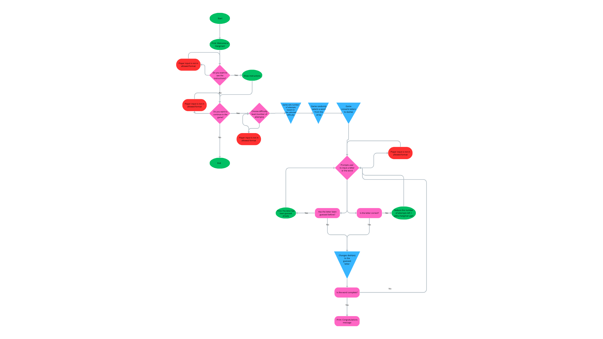

# Hangman Game

## Overview

Welcome to the Hangman Game! This project implements the classic Hangman word guessing game in Python. The game challenges players to guess a secret word by suggesting letters or guessing the entire word. Incorrect guesses lead to the gradual drawing of a hangman, and players must solve the word before running out of attempts.

## Features

- **Random Word Selection:** The game selects a random word from a predefined list, ensuring variety and unpredictability.

- **Difficulty Levels:** Players can choose from three difficulty levels, each with a different number of allowed incorrect guesses.

- **User-Friendly Interface:** The game provides a clear and user-friendly interface, prompting players for input and displaying the current game state.

- **Instructions:** Players have the option to view instructions at the beginning of the game, explaining the rules and objectives.

## How to Play

1. Run the script.
2. Choose whether to view instructions.
3. Decide whether to continue to the game.
4. Guess letters or the entire word to reveal the secret word.
5. Be cautious with incorrect guesses, as they lead to the drawing of the hangman.
6. Win by correctly guessing the word or lose by running out of attempts.

## Getting Started

Clone the repository to your local machine and run the script using a Python interpreter. Ensure you have the required dependencies, including the `hangman_parts` module for displaying the hangman.

# Development Process

**Input Validations**

Ensuring a smooth and error-free user experience was a crucial aspect of the Hangman game development. The input validation process has been carefully implemented to handle various scenarios and provide helpful feedback to the player.

**Single Letter Guesses**

Players are prompted to enter a letter when making single letter guesses. The input validation for single letter guesses covers the following:

- **Non-Empty Input:** The program checks whether the user has entered a letter, and the input must not be empty.

- **Alphabetic Characters:** The input must consist of alphabetic characters only.

- **Single Character Length:** The length of the input should be exactly one character.

**Whole Word Guesses**

For whole word guesses, where the player attempts to guess the entire word, the input validation includes:

- **Non-Empty Input:** Similar to single letter guesses, the input must not be empty.

- **Alphabetic Characters:** The input must consist of alphabetic characters only.

- **Length Check:** The length of the input can be greater than one, but it should still be a valid word.

**The flow of the game**

User Input: show_instructions

The program starts by asking the user if they want to see instructions (show_instructions).
If the user enters an invalid input, the program repeatedly prompts until a valid input ('y' or 'n') is received.
Instructions Displayed: instructions()

If the user chose to see instructions, the instructions() function is called to display the game instructions.
User Input: play_game

The program then asks the user if they want to continue to the game (play_game).
If the user enters an invalid input, the program repeatedly prompts until a valid input ('y' or 'n') is received.
Game Initialization

If the user decides to play (play_game == 'y'), the game initializes by choosing a word and setting difficulty.
Game Loop

The main game loop starts (while incorrect_guesses < max_incorrect_guesses).
The player makes guesses until they win or run out of attempts.
Game Outcome

If the player wins, a congratulatory message is displayed, and the loop breaks.
If the player loses, a message indicating the correct word is displayed.
Game Termination

If the player chooses not to play (play_game == 'n'), a farewell message is displayed, and the program returns.

*Invalid Input Handling*

If the user enters an invalid input for playing the game (else block), the program repeatedly prompts until a valid input ('y' or 'n') is received.

**User Feedback**

In case of invalid input, players receive informative error messages guiding them on the correct input format. This ensures that players understand why their input was rejected and encourages them to provide valid input.

```python
def get_guess():
    while True:
        guess = input("Enter a letter or the whole word: ").lower()
        if guess and ((guess.isalpha() and len(guess) == 1) or (len(guess) > 1 and guess.isalpha())):
            return guess
        else:
            print("Invalid input. Please enter a single letter or the whole word.")
```

By implementing robust input validations, the development process aims to enhance user experience, prevent unintended errors, and make the Hangman game more enjoyable for the players.

**Flowchart**



# Hangman Game Testing

*Scenarios tested*:

Tested incorrect user input and how it was handled by program:
- *on instructions prompt*
- *difficulty selection*
- *starting the game prompt*
- *wrong input in the game*
**PASS**

Tested starting a new game and winning:
- Finished and winning by guessing all the letters correctly
- Finished and winning by guessing the correct word
**PASS**

Tested starting a new game and losing:
- Finished by losing - no more incorrect guesses remain - game loop correctly returns so player can initiate a new game
**PASS**

Tested guessing with a word instead of a letter
- Game correctly handles correct and incorrect word guesses:
- *Incorrect word guess*: game shows the incorrect word guess among guesses
- *Correct word guess*: game ends with the congratulation message
**PASS**

Tested guessing with a word with blank space or special characters within
- Game informs the user about the incorrect input and prompts to input again
**PASS**

Tested difficulty selector:
- Game correctly chooses the maximum allowed guesses on all difficulty levels
- Game chooses the correct hangman_parts from the list on all difficulty levels
**PASS**

